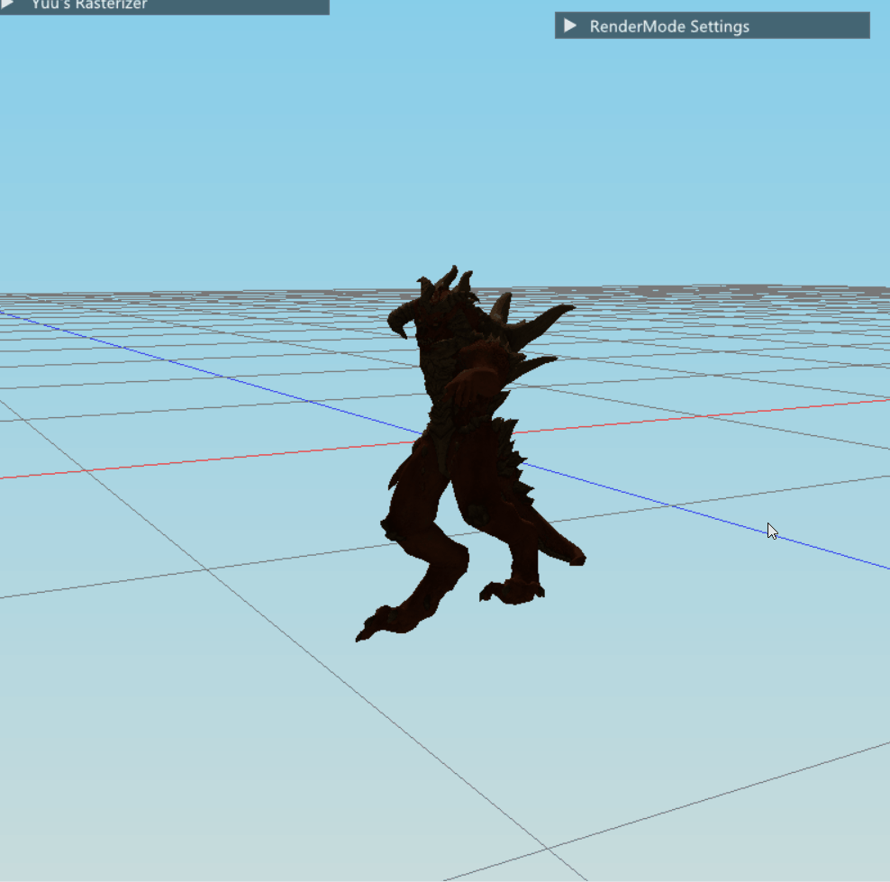
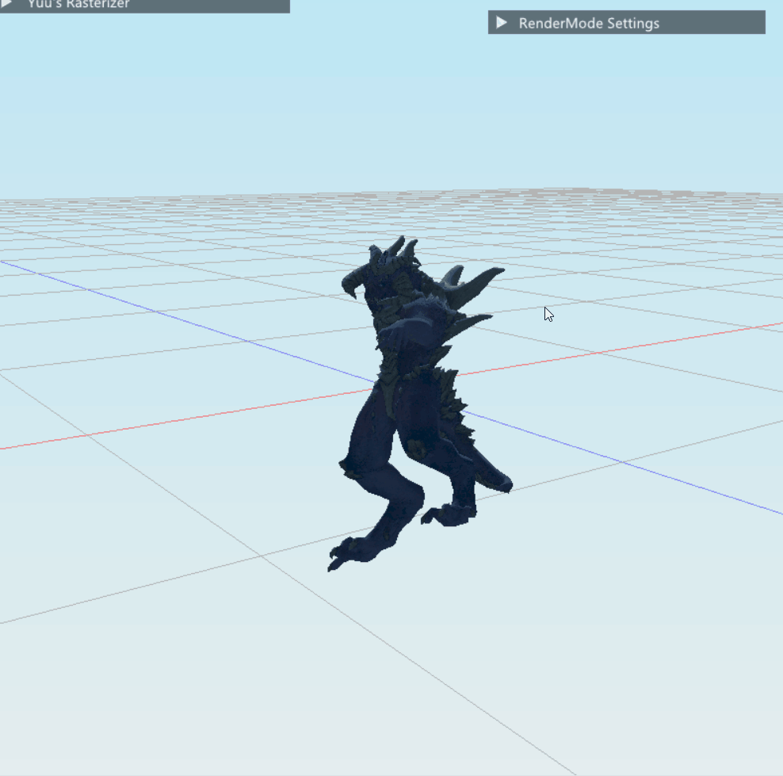
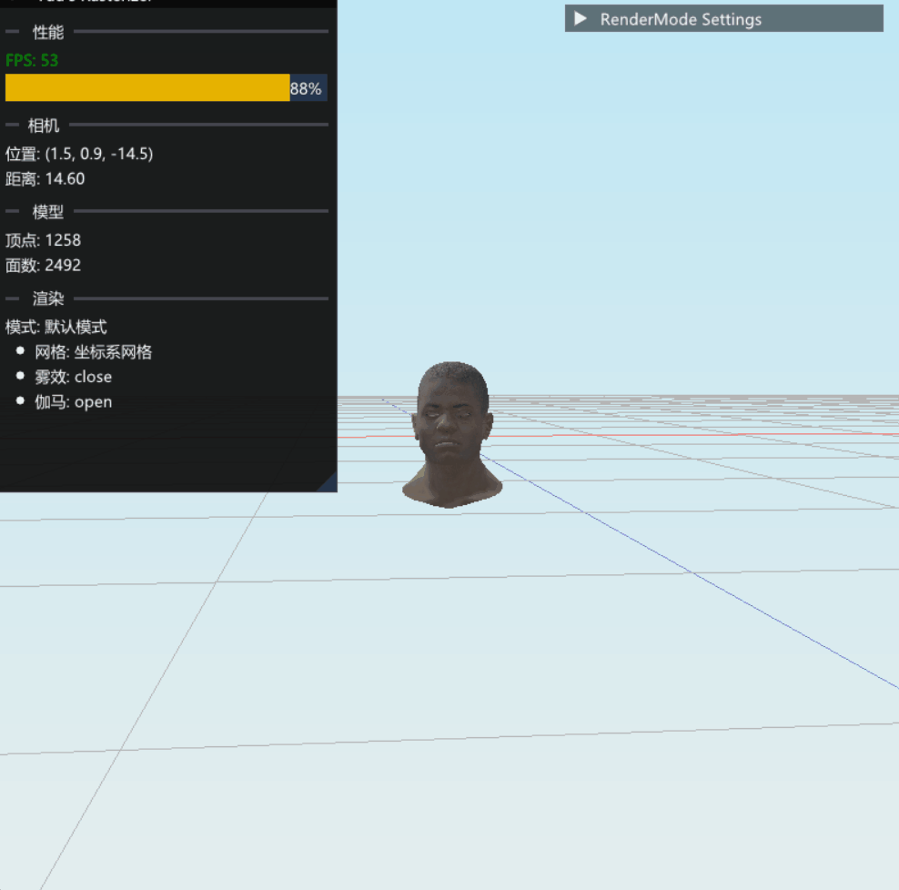
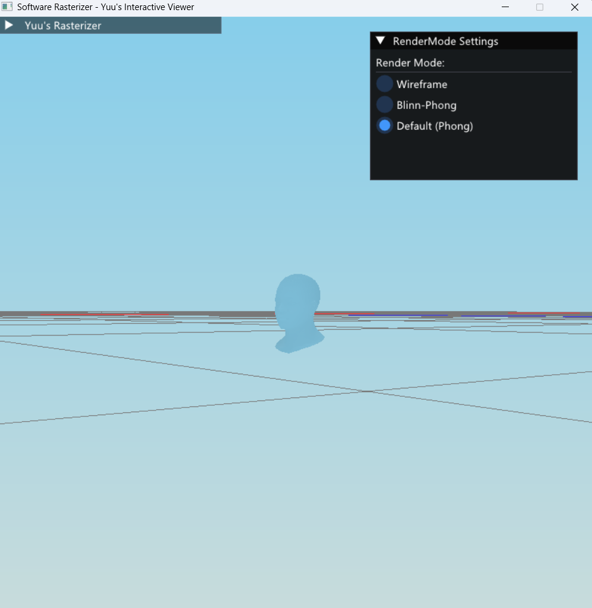
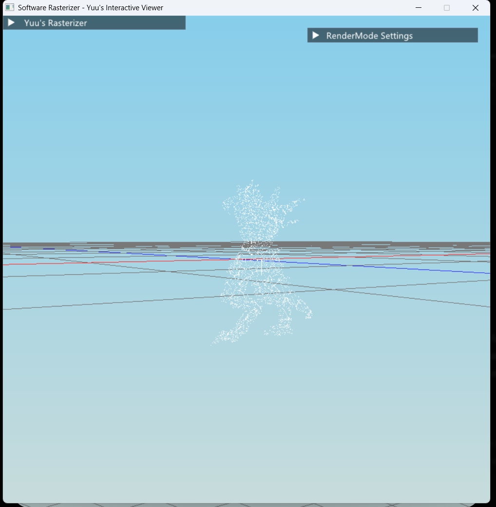
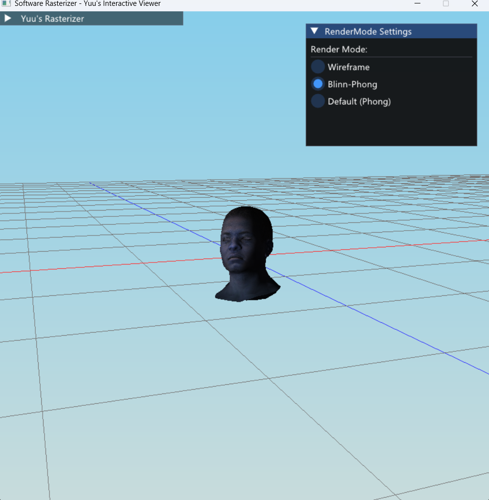

# C++ Software Rasterizer (Interactive Viewer)


> **"What I cannot create, I do not understand."**

这是一个从零开始编写的软件光栅化渲染器，**不依赖任何图形 API (OpenGL/DirectX/Vulkan)**。项目旨在通过纯 CPU 计算模拟完整的 3D 渲染管线，深入探究图形学的底层数学原理与工程实现。

不仅复现了经典的渲染算法，还集成了一个**完全交互式的 GUI 环境**，支持实时调整光照、切换渲染模式及各种调试功能。

---

##  渲染效果
<div align="center">
  <table>
    <tr>
      <td align="center">
        
        <br><i>默认渲染</i>
      </td>
      <td align="center">
        
        <br><i>线框模式</i>
      </td>
      <td align="center">
        
        <br><i>Blinn-Phong & 光照</i>
      </td>
    </tr>
  </table>
</div>

###  性能基准 

<div align="center">
  
  <br>
  <i>图示：性能测试/i>
</div>

> 测试模型：African Head (约 15,000 三角面) | 分辨率：800x600 | 平台：Windows 10

###  测试环境 
* **CPU**: [Intel Core i7-12700H] @ 2.30GHz (Single Core / Multi-thread)
* **RAM**: 32 GB DDR4
* **Optimization**: OpenMP Enabled (Parallel Rasterization)

### 性能数据 

| Render Mode | FPS (Avg) | Frame Time | Computational Cost |
| :--- | :--- | :--- | :--- |
| **Wireframe** | **60+ FPS** | < 16.6 ms |  Low (Vertex Processing Only) |
| **Blinn-Phong** | **~25 FPS** | ~40.0 ms |  High (Per-pixel Lighting + Texture) |
| **4x MSAA** | **~15 FPS** | ~66.6 ms |  Very High (4x Depth Samples) |

###  优化策略 
为了在 CPU 上实现可交互的帧率，项目实施了以下优化：

1.  **Back-face Culling (背面剔除)**:
    * 在光栅化阶段前计算三角形法线，剔除背向摄像机的面。
    * **收益**: 减少了约 **50%** 的像素着色计算量。

2.  **Bounding Box Traversal (包围盒遍历)**:
    * 仅遍历三角形 AABB (Axis-Aligned Bounding Box) 内的像素，而非全屏扫描。
    * **收益**: 将像素遍历复杂度从屏幕分辨率 $O(W \times H)$ 降低至三角形大小相关。

3.  **Parallel Rasterization (OpenMP)**:
    * 利用 `#pragma omp parallel for` 对三角形光栅化循环进行多线程加速。
    * **收益**: 在多核 CPU 上提升了约 **40%-60%** 的渲染性能。

4.  **Early-Z Test (早期深度测试)**:
    * 在执行复杂的 Fragment Shader (纹理采样/光照计算) 之前，先进行深度测试。
    * **收益**: 避免了被遮挡像素的无效计算。

### 实时交互环境
集成了 **Dear ImGui**，允许在运行时实时调整 Shader 参数、观察模型细节并监控性能。

### 渲染模式对比
支持多种渲染模式的实时热切换，用于调试几何结构与光照计算。

<table>
  <tr>
    <td align="center"><b>FogEffect</b></td>
    <td align="center"><b>Wireframe Mode</b></td>
    <td align="center"><b>Blinn-Phong Shading</b></td>
  </tr>
  <tr>
    <td align="center"></td>
    <td align="center"></td>
    <td align="center"></td>
  </tr>
  <tr>
    <td align="center">基于距离的雾颜色和物体颜色的插值运算<br>(带背面剔除)</td>
    <td align="center">基于重心坐标的三角形光栅化<br>(带背面剔除)</td>
    <td align="center">基于法线插值的高光渲染<br>(带纹理映射)</td>
  </tr>
</table>

---

##  核心特性 

###  渲染管线 
* **Math Library**: 手写数学库，实现了 `Vector`, `Matrix`, `Quaternion` 等核心运算。
* **Transform**: 完整的 MVP (Model-View-Projection) 变换矩阵推导。
* **Clipping**: 视锥体裁剪 (Frustum Culling) 与 齐次空间裁剪。
* **Rasterization**: 
    * **基于包围盒 (Bounding Box)** 的三角形遍历算法。
    * **透视校正插值 (Perspective Correct Interpolation)**：修复纹理在透视投影下的扭曲。
    * **深度测试 (Z-Buffering)**：处理复杂的物体遮挡关系。

###  着色与光照 
* **可编程管线模拟**: 抽象了 `VertexShader` 和 `FragmentShader`，模拟 GPU 工作流。
* **光照模型**: 
    * Flat Shading
    * Gouraud Shading
    * **Phong & Blinn-Phong Shading**
* **纹理映射**: 支持 Diffuse Map（漫反射贴图）与 Specular Map（高光贴图），使用双线性插值采样。
* **高级特性**:
    * **Gamma Correction**: 线性空间光照计算。
    * **Linear Fog**: 基于深度的线性雾效。

###  工程与交互 
* **Interactive UI**: 集成 ImGui，支持 FPS 统计、参数滑块调节。
* **Camera System**: 实现了类似 FPS 游戏的摄像机控制（平移/旋转/缩放）。
* **Debug Tools**: 世界空间网格 (Grid)、坐标轴可视化、线框模式切换。
* **Performance**: 使用 OpenMP 进行多线程像素着色加速。

---

##  控制指南 (Controls)

###  鼠标交互 (Mouse Interaction)
| 操作 | 功能 | 描述 |
| :--- | :--- | :--- |
| **Left Drag** (左键拖拽) | 旋转视角 | 围绕中心点进行轨道旋转 (Orbit) |
| **Right Drag** (右键拖拽) | 平移相机 | 在屏幕空间平移视口 (Pan) |
| **Scroll** (滚轮) | 缩放 | 推拉相机距离 (Zoom) |

### ⌨ 渲染与系统 (System & Rendering)
| 按键 | 功能 | 说明 |
| :--- | :--- | :--- |
| **Ctrl + Z** | 切换渲染模式 | 在 Wireframe / Flat / Blinn-Phong 间循环 |
| **Shift + 1/2/3** | 切换模型 | 加载并切换场景中的不同模型 |
| **P** | 投影模式切换 | 切换透视投影 (Perspective) / 正交投影 (Orthographic) |
| **G** | 网格显示 | 开启/关闭地面辅助网格 |
| **Ctrl + G** | 简单网格 | 切换网格的精细度模式 |
| **U** | 雾效开关 | 开启/关闭线性深度雾 (Linear Fog) |
| **Q** | Gamma 校正 | 开启/关闭 SRGB Gamma 校正 |
| **ESC** | 退出程序 | 关闭查看器 |

###  光照与环境 (Lighting & Environment)
| 按键 | 功能 |
| :--- | :--- |
| **T** | 推进时间 | 模拟昼夜变化，时间 +1 小时 |
| **R** | 自动旋转 | 开启/关闭太阳自动公转动画 |

###  视图快捷键 (Viewport Shortcuts)
| 按键 (Numpad) | 功能 | 按键组合 | 功能 |
| :--- | :--- | :--- | :--- |
| **Numpad .** | 聚焦模型 (Focus) | **F** | 恢复默认视角 (Reset) |
| **Numpad 1** | 前视图 (Front) | **Ctrl + 1** | 后视图 (Back) |
| **Numpad 3** | 右视图 (Right) | **Ctrl + 3** | 左视图 (Left) |
| **Numpad 7** | 顶视图 (Top) | **Ctrl + 7** | 底视图 (Bottom) |

---

##  快速开始 (Build & Run)

### 环境依赖
* **Compiler**: C++17 (MSVC / GCC / Clang)
* **Dependencies**: [SDL2](https://www.libsdl.org/) (Window & Input)

### 构建 (CMake)

```bash

git clone [https://github.com/YourUsername/SoftwareRasterizer.git](https://github.com/YourUsername/SoftwareRasterizer.git)
cd SoftwareRasterizer

mkdir build && cd build
cmake ..
cmake --build . --config Release

./SoftwareRasterizer
```


##  致谢与参考 (Acknowledgements)

###  学习资源 (Learning Resources)
特别感谢以下优秀的教程与课程，为本项目提供了理论基础与灵感：

* **[TinyRenderer](https://github.com/ssloy/tinyrenderer)** - **Dmitry V. Sokolov**
    * 本项目的核心灵感来源。跟随教程理解了光栅化的从零实现过程。
* **[GAMES101: 现代计算机图形学入门](https://sites.cs.ucsb.edu/~lingqi/teaching/games101.html)** - **闫令琪 (Lingqi Yan)**
    * 提供了坚实的图形学数学基础（线性代数、变换、透视矫正）与理论支持。
* **[LearnOpenGL](https://learnopengl.com/)** - **Joey de Vries**
    * 在实现 Blinn-Phong 光照模型、伽马校正及纹理系统时提供了宝贵的参考。

###  第三方库 (Third-party Libraries)
本项目站在巨人的肩膀上，使用了以下开源库来处理窗口与交互：

* **[SDL2](https://www.libsdl.org/)**: 用于跨平台的窗口管理与输入事件处理。
* **[Dear ImGui](https://github.com/ocornut/imgui)**: 用于构建实时的交互式调试界面。
* **[stb_image](https://github.com/nothings/stb)**: 用于加载和解析纹理图片。
